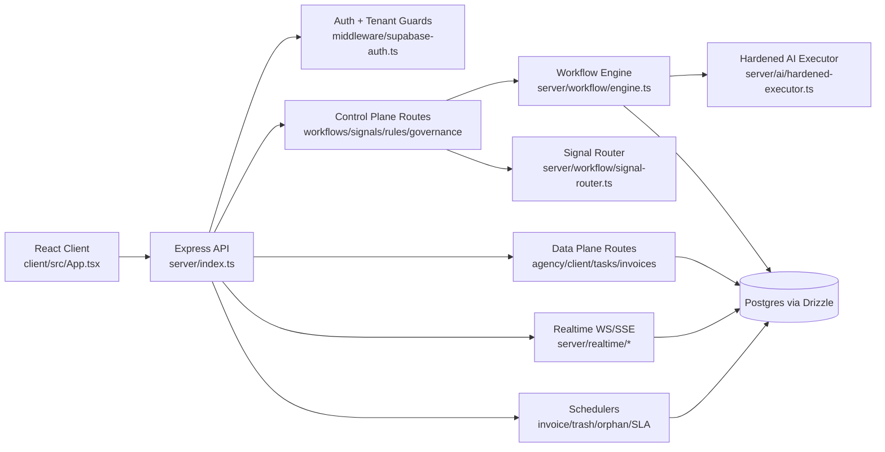
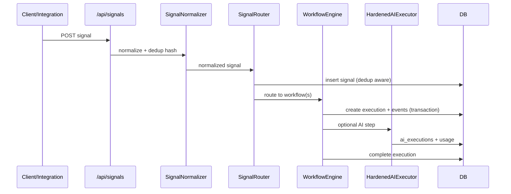
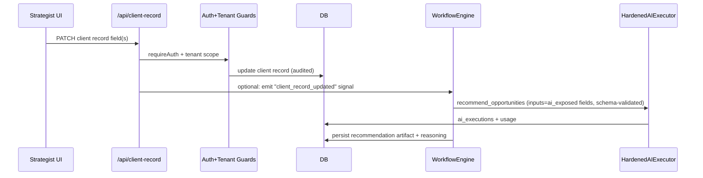

# AgentDash Architecture (Primitive-Oriented)

## Overview

AgentDash is a single deployable web app with:
- A React client (`client/src/main.tsx`, `client/src/App.tsx`) acting as UI/control surface.
- An Express server (`server/index.ts`) hosting API, realtime, and schedulers.
- Shared schema contracts in Drizzle (`shared/schema.ts`) used by runtime and persistence.

The runtime now uses a modular routing model with a thin compatibility shim:
- Modular domain routers mounted by registry (`server/routes/index.ts`).
- `server/routes.ts` primarily sets policy boundaries and mounts modular routers.

### Control Plane vs Data Plane

- **Control plane**: Workflow/rule/signal/governance configuration and policy.
  - `server/routes/workflows.ts`
  - `server/routes/rule-engine.ts`
  - `server/routes/signals.ts`
  - `server/governance/governance-routes.ts`
  - `server/routes/superadmin.ts`
- **Data plane**: Operational business state and executions (clients/projects/tasks/invoices/intelligence/realtime).
  - Domain routes in `server/routes/*.ts`
  - Workflow execution engine in `server/workflow/engine.ts`
  - Persistence gateway `server/storage.ts`

## Runtime Diagram

## Enforcement Boundaries (Where Claims Are Enforced)

- **Process boundary / middleware stack**: `server/index.ts` (`helmet`, request id, metrics, rate limiter, maintenance).
- **Principal + tenant resolution**: `requireAuth`, `requireRole`, `require*Access` in `server/middleware/supabase-auth.ts`.
- **Agency scope resolution for mixed admin/superadmin calls**: `resolveAgencyContext` in `server/middleware/agency-context.ts`.
- **Signal input normalization + dedup**: `SignalNormalizer.normalize` (`server/workflow/signal-normalizer.ts`) and `createWorkflowSignalWithDedup` (`server/storage.ts`).
- **Workflow idempotency + transactional execution**: `WorkflowEngine.execute` (`server/workflow/engine.ts`).
- **AI policy gate (quota + schema + execution log)**: `HardenedAIExecutor.executeWithSchema` (`server/ai/hardened-executor.ts`) + `QuotaService` (`server/governance/quota-service.ts`).

## Side Effects Map

- **Filesystem**: uploads + invoice/static directories (`server/index.ts`, `server/routes.ts`, `server/services/pdfStorage.ts`).
- **Database**: Drizzle client (`server/db.ts`) + broad repository (`server/storage.ts`) + direct engine writes (`server/workflow/engine.ts`).
- **External network**: Supabase auth/admin (`server/lib/supabase.ts`, `server/lib/supabase-auth.ts`), AI providers (`server/ai/*`), third-party integrations (`server/lib/googleOAuth.ts`, `server/lib/hubspot.ts`, `server/lib/linkedin.ts`).
- **Realtime network**: WS + SSE (`server/realtime/websocket-server.ts`, `server/realtime/realtime-routes.ts`).
- **Scheduled mutations**: cron jobs launched at startup (`server/index.ts`, `server/services/*Scheduler.ts`, `server/jobs/orphan-cleanup.ts`, `server/sla/sla-cron.ts`).

## Key Flows

### 1) Normal Flow (Signal -> Rule -> Workflow -> Action)

Evidence:
- `server/routes/signals.ts` (`/signals/:source/ingest`)
- `server/workflow/signal-normalizer.ts` (`computeDedupHash`, `normalize`)
- `server/workflow/signal-router.ts` (`ingestSignal`, `findMatchingRoutes`)
- `server/workflow/engine.ts` (`execute`, `logEvent`, `completeExecution`)
- `server/ai/hardened-executor.ts` (`executeWithSchema`)

### 2) Delayed-Attack / Replay Flow

Attack model in current system: delayed replay of previously valid external signal payload.

Observed handling:
1. Canonical payload hash is recomputed (`SignalNormalizer.computeDedupHash`).
2. Existing hash in same agency is detected (`createWorkflowSignalWithDedup`).
3. Duplicate returns without re-triggering workflows (`SignalRouter.ingestSignal`).

Evidence:
- `server/workflow/signal-normalizer.ts`
- `server/storage.ts` (`createWorkflowSignalWithDedup`, `getWorkflowSignalByDedupHash`)
- `server/workflow/signal-router.ts` (`isDuplicate` short-circuit)

### 3) Recovery Flow (Execution Failure -> Retry)

1. Step failure marks workflow execution failed (`WorkflowEngine.failExecution`).
2. Failed signal can be re-queued by API (`POST /signals/:id/retry`).
3. Retry path increments retry counter and sets pending status (`SignalRouter.retrySignal`).

Evidence:
- `server/workflow/engine.ts` (`failExecution`)
- `server/routes/signals.ts` (`/signals/:id/retry`)
- `server/workflow/signal-router.ts` (`retrySignal`)
- `server/storage.ts` (`incrementSignalRetry`, `updateSignalStatus`)

## What We’re Not Solving (Current Threat Model Limits)

- No full byzantine tamper-evidence chain across all events; logs are append-style tables but not cryptographically chained.
- No global exactly-once guarantee across all side effects; idempotency is strong for workflow execution hash and signal dedup, not universal across every route.
- Realtime auth stack is split (`supabase-auth` for API vs local JWT verifier in `server/realtime/*`), which is an architectural inconsistency to be removed in rebuild phases.
- Browser cross-origin requests are not a supported API feature in the current server bootstrap.

## How To Extend Safely

1. Add new externally-triggered behavior through **Signal Normalizer + Router**, not direct workflow invocation.
2. Add route mutations behind `requireAuth` + role + tenant guard (`require*Access`) and agency scope resolver when needed.
3. Put any model call behind `HardenedAIExecutor` to inherit quota, schema-validation, and execution logging.
4. Persist new cross-cutting telemetry in explicit append-only tables (similar to `workflow_events`, `ai_executions`, `governance_audit_logs`).
5. Keep side effects inside transaction-aware orchestration boundaries (workflow engine or explicit service layer), not scattered in route handlers.

---

## Client Record as Decision-Input Contract (Control Centre–Aligned)

**Purpose**: The Client Record is a **data-plane object** that stores governed context and signals that the platform is allowed to use to generate **opportunity-level recommendations**. It is not a task list, backlog, or delivery brief.

### Plane + Boundary Rules

- Client Record fields are **Data Plane** only. Any field that implies *execution readiness*, *next actions*, *task status*, or *delivery scope* is **not allowed** in this object.
- Updates to Client Record must pass:
  1) **INV1 Auth** and 2) **INV2 Tenant isolation**.
- Any field exposed to the AI Engine must be schema-validated as a contract (see INV4 extension below).

### Schema Contract (Required Columns)

The Client Record field catalog (CSV) must be self-describing so it can be enforced by code and tests:

- `field_key` (stable machine key; snake_case; immutable once shipped)
- `plane` = `data`
- `data_type` (string/enum/int/float/url/date/json)
- `allowed_values` (for enums)
- `nullable` (true/false)
- `scope` (agency/client)
- `read_roles` / `write_roles`
- `update_mode` (manual | signal | derived)
- `signal_source` (ga4/gsc/hubspot/manual_note/etc.)
- `freshness_sla_days`
- `confidence_required` (high/med/low)
- `ai_exposed` (true/false)  **← gate for AI input**
- `primitive_owner` (P1..P8)
- `audit_required` (true/false)

### How the AI Engine Uses This (Allowed)

The AI Engine may:
- read `ai_exposed=true` fields only
- produce **ranked opportunities**, with reasoning + assumptions
- never produce tasks, execution steps, or scope changes

This matches the platform doctrine: decisioning lives in Control Centre; execution is downstream.

### Key Flow: Client Record -> Opportunity Recommendation

**Implementation note**: If the codebase does not yet have `/api/client-record`, treat the Client Record as a domain router in Data Plane, while recommendation generation remains Control Plane orchestration (workflows/signals).
